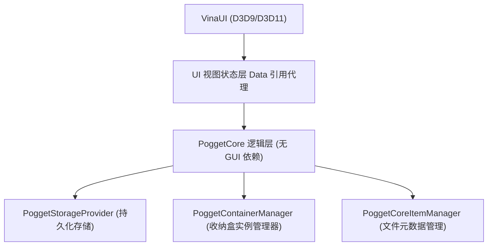

# PoggetCore 轻量桌面收纳与整理引擎

PoggetCore 是一款基于 C++20 构建的高性能、跨平台架构的桌面收纳与桌面整理工具。在 Pogget 的实践中，PoggetCore 搭载 [VinaUI](https://github.com/EnderMo/VinaUI) 进行接入，实现轻量、高性能的渲染。

---

## 核心架构分层

PoggetCore 遵循严格的单向依赖与分层设计，将底层数据逻辑与上层渲染引擎彻底解耦：

