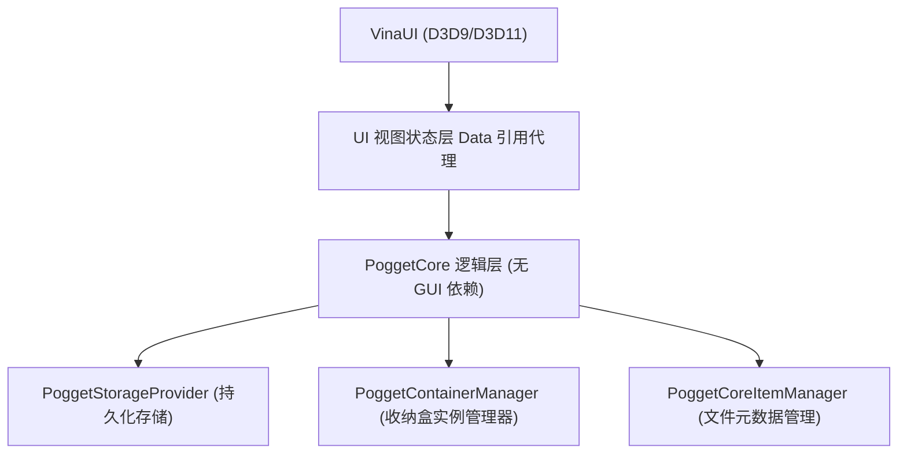

# PoggetCore 轻量桌面收纳与整理引擎

PoggetCore 是一款基于 C++20 构建的高性能、跨平台架构的桌面收纳与桌面整理工具。在 Pogget 的实践中，PoggetCore 搭载 [VinaUI](https://github.com/EnderMo/VinaUI) 进行接入，实现轻量、高性能的渲染。

---

## 核心架构分层

PoggetCore 遵循严格的单向依赖与分层设计，将底层数据逻辑与上层渲染引擎彻底解耦：

### PoggetCore 逻辑层
- **`PoggetCore::Storage`**：收纳盒的序列化解析模块（包含 `VinaStorage`、`VinaBuilder` 与 `vui.parser` 解析引擎）。
- **`::tsl`**：内置有序哈希表算法依赖库 (`tsl::ordered_map`)。
- **`ContainerModel`**：收纳盒纯逻辑模型，包含全部偏好属性、排版配置、批量选中句柄及撤消重做历史栈。
- **`PoggetContainerManager`**：基于全局唯一收纳盒 ID (`ComID_xxx`) 进行生命周期路由与多端注册管理。
- **`PoggetCoreItemManager`**：接管文件元数据缓存（包含图标尺寸、时间戳、目录状态等）。
- **`PoggetStorageProvider`**：持久化引擎，包含磁盘 `.vina` 结构及 `ResMem_` 多分辨率布局自适应备份。
- **`PoggetCoreManager`**：排版计算组件，计算图标的排版位置并向渲染层提供接口。
